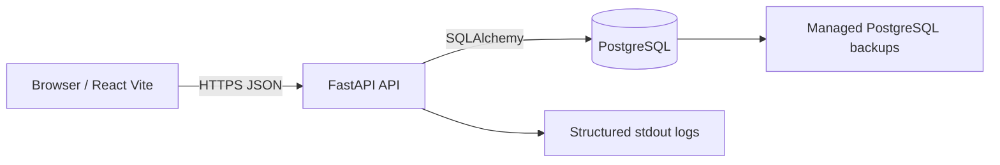
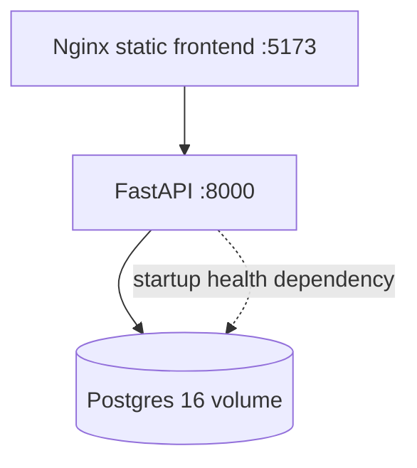
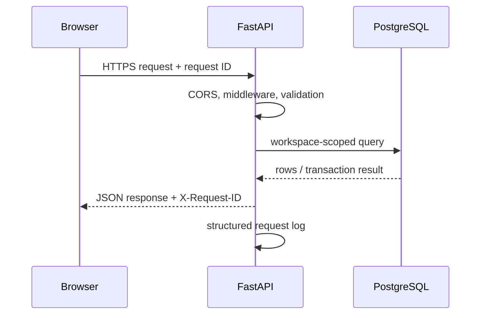

# Personal Work OS architecture

## Runtime topology

## Local Docker topology

## Request lifecycle

## Data ownership

`workspaces` own projects, work items, contacts, activities, communications, tags, and journals. Every query must be constrained by the authenticated workspace.

## Authentication

Authentication is always on and fails closed: any `/api` route other than health, login, and register requires a valid bearer token, and there is no anonymous or default workspace. Tokens are HS256 JWTs carrying `sub`, `workspace_id`, `ver`, `iat`, and `exp`. The API refuses to start or issue tokens without a `JWT_SECRET` of at least 32 characters. `ver` must match `users.token_version`; `POST /api/auth/logout` (or `manage.py revoke-sessions`) increments it and revokes every token for that user. Registration is closed unless `ALLOW_REGISTRATION=true`.

Middleware order, outermost first: CORS → request logging → rate limit → auth. CORS must stay outermost so browser preflights never reach auth and 401/429 responses remain readable by the frontend.

## History integrity

Activities are the audit trail. The server alone writes the system events `Created`, `Status changed`, `Updated` (lists the edited fields), and `Moved` (old and new project code), and the API rejects client attempts to write them. Clients may add work-log entries of any other type (Comment, Investigation, Testing, ...), without old/new values.

Work item numbers (`WRK-YYYY-#####`) are unique per workspace and allocated from a row-locked `work_item_counters` row, so concurrent creates are serialized rather than colliding. References to contacts and assignees must belong to the same workspace.

## Code map

| Location | Responsibility |
|---|---|
| `src/main.tsx` | Existing UI composition and user interactions |
| `src/api/client.ts` | Typed HTTP client and API error normalization |
| `src/api/localImport.ts` | One-time import from the prototype's localStorage shape |
| `backend/main.py` | SQLAlchemy models, workspace-scoped API routes, validation, and startup bootstrap |
| `backend/alembic/` | Database migration environment and revisions (the only schema owner) |
| `backend/manage.py` | Account administration: create-user, claim-local, revoke-sessions |
| `docker-compose.yml` | Local frontend, API, and PostgreSQL services |
| `.dockerignore` | Keeps build contexts small and excludes local state |

## Error and logging model

- HTTP errors return `{ error: { code, message, request_id } }`.
- Unexpected errors return a generic message and are logged with a request ID.
- Every response includes `X-Request-ID`.
- Request logs are JSON on stdout so Render/Docker log collectors can index them.
- Never log passwords, tokens, database URLs, or request bodies containing private notes.

## Production security gates

See `SECURITY_CHECKLIST.md` for what is done and what remains before inviting anyone else.
