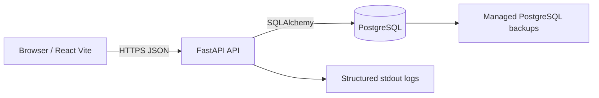
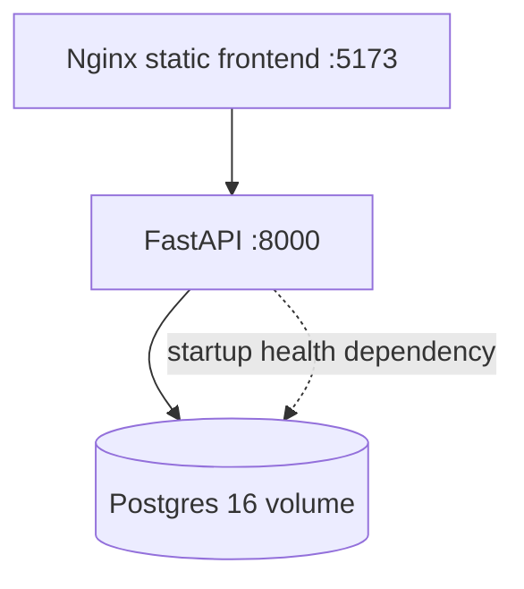
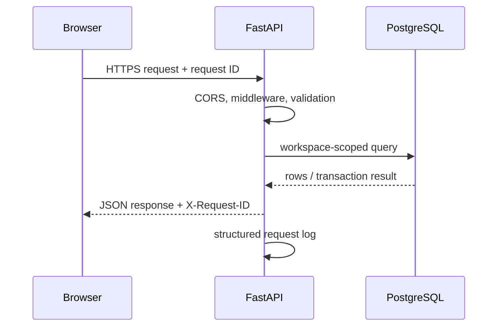

# Personal Work OS architecture

## Runtime topology

## Local Docker topology

## Request lifecycle

## Data ownership

`workspaces` own projects, work items, contacts, activities, communications, tags, and journals. Every query must be constrained by the authenticated workspace. The current development build uses a bootstrapped local workspace; authentication is the remaining security gate before public deployment.

## Code map

| Location | Responsibility |
|---|---|
| `src/main.tsx` | Existing UI composition and user interactions |
| `src/api/client.ts` | Typed HTTP client and API error normalization |
| `src/api/localImport.ts` | One-time import from the prototype's localStorage shape |
| `backend/main.py` | SQLAlchemy models, workspace-scoped API routes, validation, and startup bootstrap |
| `backend/alembic/` | Database migration environment and revisions |
| `docker-compose.yml` | Local frontend, API, and PostgreSQL services |
| `.dockerignore` | Keeps build contexts small and excludes local state |

## Error and logging model

- HTTP errors return `{ error: { code, message, request_id } }`.
- Unexpected errors return a generic message and are logged with a request ID.
- Every response includes `X-Request-ID`.
- Request logs are JSON on stdout so Render/Docker log collectors can index them.
- Never log passwords, tokens, database URLs, or request bodies containing private notes.

## Production security gates

Before public launch, complete: password hashing and login/session tokens, authenticated workspace context, rate limiting, production CORS allowlist, secret injection, HTTPS-only deployment, Alembic-only startup migrations, automated tests for workspace isolation, and managed database backups/restore verification.
